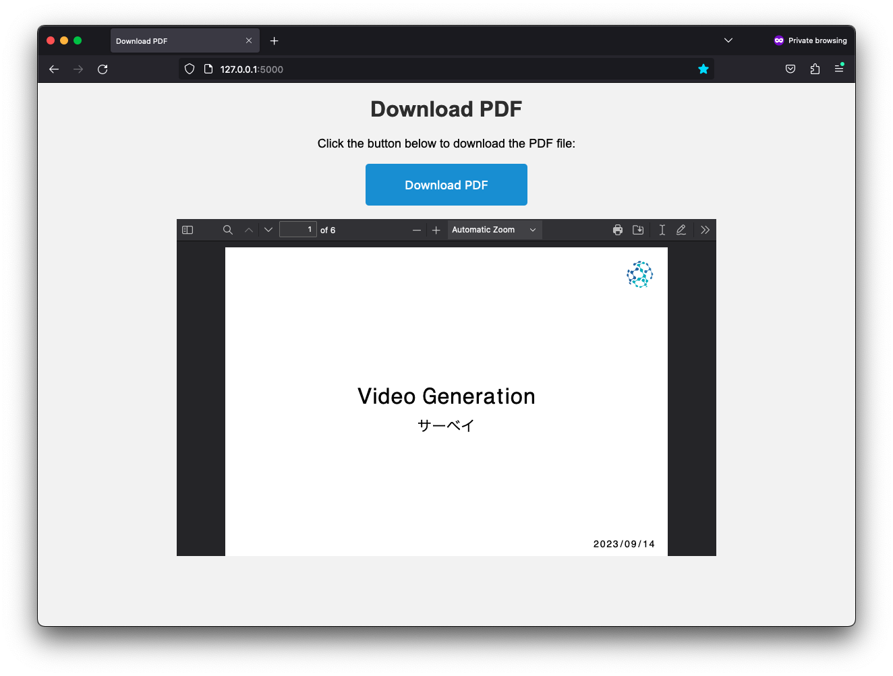

# Survey GPT

[日本語版 README.md (chatGPT翻訳)](README_JA.md)

Generate simple survey slides from a list of keywords or a list of paper titles:

## Setup
1. clone this repository: `git clone https://github.com/Hiromasa-H/survey_gpt.git`
2. navigate to survey_gpt: `cd survey_gpt`
3. install required packages: `pip install -r requirements.txt`
4. add env file: `touch .env`
5. add OpenAI API Key: `echo OPENAI_API_KEY ="API KEY HERE" >> .env`
   - How to get an API key: [instructions](https://www.howtogeek.com/885918/how-to-get-an-openai-api-key/)

## Usage
1. run the app: `python app.py`
2. go to localhost on your browser: `http://127.0.0.1:5000` (note that the port may be different on your machine)
3. enter either a keyword or a list of keywords separated by commas, and click "generate PDF"

1. wait for the PDF slides to be generated
2. once the results are generated, click on download to download the PDF file
  - alternatively, navigate to `survery_gpt/static/slides/presentation.pdf` and access the pdf from there. Note that this pdf will be overwritten the next time you generate a pdf.
  

## TODO

- [x] Add frontend
- [x] Add arxiv API manager
  - [ ] Add reference count
- [x] Add PDF maker
- [ ] Plan integration with connected papers or something similar
- [ ] Add a way to summarize the survey itself 
- [ ] Add Language choice
- [ ] Add a way to choose the number of papers to include
- [ ] Add a way to specify the title of the slides