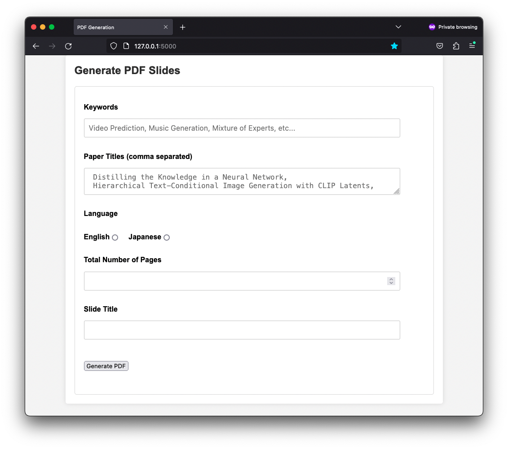
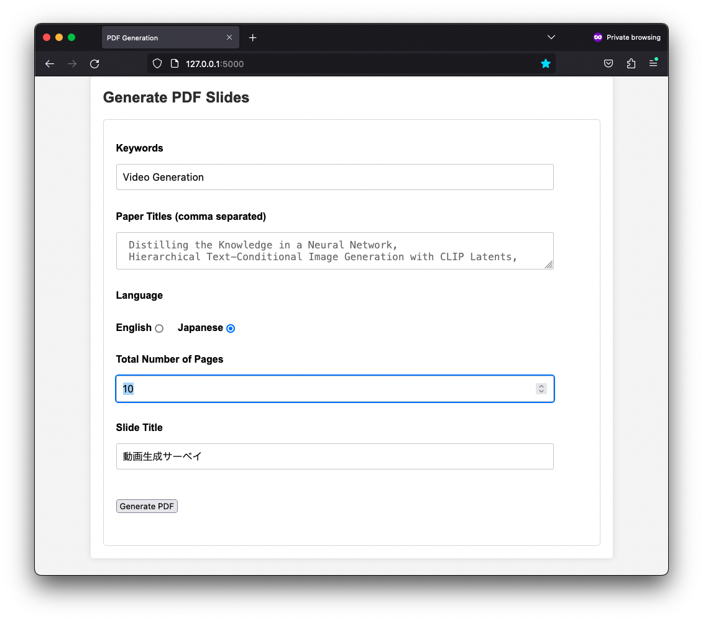

# Survey GPT

[英語版 README.md](README.md)

キーワードのリストまたは論文タイトルのリストから、シンプルな調査スライドを生成します:

## セットアップ
1. このリポジトリをクローンしてください: `git clone https://github.com/Hiromasa-H/survey_gpt.git`
2. survey_gptディレクトリに移動してください: `cd survey_gpt`
3. 必要なパッケージをインストールしてください: `pip install -r requirements.txt`
4. 環境ファイルを追加してください: `touch .env`
5. OpenAI APIキーを追加してください: `echo OPENAI_API_KEY ="ここにAPIキーを入力" >> .env`
   - APIキーの取得方法: [手順](https://book.st-hakky.com/docs/open-ai-create-api-key/)

## 使い方
1. アプリを実行してください: `python app.py`
2. ブラウザでlocalhostに移動してください: `http://127.0.0.1:5000`（ポートはお使いのマシンによって異なる場合があります）
3. キーワードまたはコンマで区切られたキーワードのリストを入力し、「PDFを生成」をクリックしてください

1. PDFスライドの生成を待ってください
2. 結果が生成されたら、ダウンロードしてPDFファイルを保存してください
   - あるいは、`survery_gpt/static/slides/presentation.pdf`に移動して、そこからPDFにアクセスしてください。なお、次回PDFを生成する際にはこのPDFが上書きされます。
   

## 未完了タスク

- [x] フロントエンドを追加
- [x] arXiv APIマネージャーを追加
  - [ ] 参考文献数を追加
- [x] PDFメーカーを追加
- [ ] Markdownメーカーを追加
- [ ] Connected Papersなどとの統合を計画
- [ ] 調査自体を要約する方法を追加
- [ ] 言語の選択を追加
- [ ] 含める論文の数を選択する方法を追加
